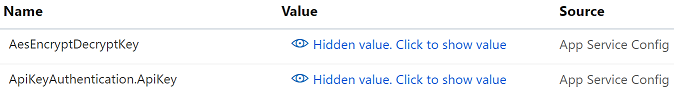
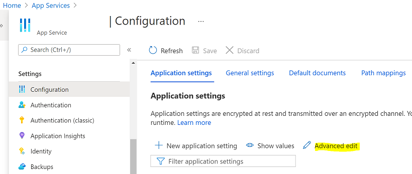

# InRule CI/CD Service - Azure

If you have not done so already, please read the [prerequisites](README.md#prerequisites) before you get started.

#### Deploying a new instance:

* [App Service Deployment](#deployment)
* [App Service Configuration](#configuration)

## Deployment

## Sign in to Microsoft Azure
First, [open a PowerShell prompt](https://docs.microsoft.com/en-us/powershell/scripting/setup/starting-windows-powershell) and use the Microsoft Azure® CLI to [sign in](https://docs.microsoft.com/en-us/cli/azure/authenticate-azure-cli) to your Microsoft Azure subscription:
```powershell
az login
```

## Set active subscription
If your Microsoft Azure account has access to multiple subscriptions, you will need to [set your active subscription](https://docs.microsoft.com/en-us/cli/azure/account#az-account-set) to where you create your Microsoft Azure resources:
```powershell
# Example: az account set --subscription "Contoso Subscription 1"
az account set --subscription SUBSCRIPTION_NAME
```

## Create resource group
Create the resource group (one resource group per environment is typical) that will contain the InRule®-related Microsoft Azure resources with the [az group create](https://docs.microsoft.com/en-us/cli/azure/group#az-group-create) command:
```powershell
# Example: az group create --name inrule-prod-rg --location eastus
az group create --name RESOURCE_GROUP_NAME --location LOCATION
```

## Create App Service plan
Create the [App Service plan](https://docs.microsoft.com/en-us/azure/app-service/azure-web-sites-web-hosting-plans-in-depth-overview) that will host the InRule-related web apps with the [az appservice plan create](https://docs.microsoft.com/en-us/cli/azure/appservice/plan#az-appservice-plan-create) command:
```powershell
# Example: az appservice plan create --name inrule-prod-sp --resource-group inrule-prod-rg --location eastus
az appservice plan create --name APP_SERVICE_PLAN_NAME --resource-group RESOURCE_GROUP_NAME --location LOCATION
```

## Create Web App
Create the [Microsoft Azure App Service Web App](https://docs.microsoft.com/en-us/azure/app-service/app-service-web-overview) for InRule CI/CD Service with the [az webapp create](https://docs.microsoft.com/en-us/cli/azure/webapp#az-webapp-create) command:
```powershell
# Example: az webapp create --name contoso-inrule-cicd-prod-wa --plan inrule-prod-sp --resource-group inrule-prod-rg
az webapp create --name WEB_APP_NAME --plan APP_SERVICE_PLAN_NAME --resource-group RESOURCE_GROUP_NAME
```

## Deploy package
First, [download](https://github.com/InRule/InRuleCICD/tree/main/Deployment/releases) the latest irServer® Rule Execution Service package (`InRule.CICD.Runtime.Service.zip`) from GitHub. Then [deploy the zip file](https://docs.microsoft.com/en-us/azure/app-service/app-service-deploy-zip) package to the Web App with the [az webapp deployment source](https://docs.microsoft.com/en-us/cli/azure/webapp/deployment/source#az-webapp-deployment-source-config-zip) command:
```powershell
# Example: az webapp deployment source config-zip --name contoso-inrule-cicd-prod-wa --resource-group inrule-prod-rg --src InRule.CICD.Runtime.Service.zip
az webapp deployment source config-zip --name WEB_APP_NAME --resource-group RESOURCE_GROUP_NAME --src FILE_PATH
```

## Upload valid license file
In order for irServer Rule Execution Service to properly function, a valid license file must be uploaded to the web app. The simplest way to upload the license file is via FTP.

First, retrieve the FTP deployment profile (url and credentials) with the [az webapp deployment list-publishing-profiles](https://docs.microsoft.com/en-us/cli/azure/webapp/deployment#az-webapp-deployment-list-publishing-profiles) command and put the values into a variable:
```powershell
# Example: az webapp deployment list-publishing-profiles --name contoso-inrule-cicd-prod-wa --resource-group inrule-prod-rg --query "[?contains(publishMethod, 'FTP')].{publishUrl:publishUrl,userName:userName,userPWD:userPWD}[0]" | ConvertFrom-Json -OutVariable creds | Out-Null
az webapp deployment list-publishing-profiles --name WEB_APP_NAME --resource-group RESOURCE_GROUP_NAME --query "[?contains(publishMethod, 'FTP')].{publishUrl:publishUrl,userName:userName,userPWD:userPWD}[0]" | ConvertFrom-Json -OutVariable creds | Out-Null
```

Then, upload the license file using those retrieved values:
```powershell
# Example: $client = New-Object System.Net.WebClient;$client.Credentials = New-Object System.Net.NetworkCredential($creds.userName,$creds.userPWD);$uri = New-Object System.Uri($creds.publishUrl + "/InRuleLicense.xml");$client.UploadFile($uri, "$pwd\InRuleLicense.xml");
$client = New-Object System.Net.WebClient;$client.Credentials = New-Object System.Net.NetworkCredential($creds.userName,$creds.userPWD);$uri = New-Object System.Uri($creds.publishUrl + "/InRuleLicense.xml");$client.UploadFile($uri, "LICENSE_FILE_ABSOLUTE_PATH");
```

### Configure InRule CI/CD service
The service requires a set of key value pairs in order to function properly, like the subscription key provided by InRule and the symmetric encryption/decryption key used to secure the communication with the irCatalog® Service.

For now, it is possible to [download the starter config file](../config/InRule.CICD.Runtime.Service.config.json), in the format that is accepted when updating the app service via the Azure portal, and edit it. The starter file has only a few keys enabled, enough to ensure the encryption of the communication with the catalog and have the service react to a number of catalog events with a Slack message. The Slack webhook URL would have to be replaced with the correct value needed to send messages to the channel chosen and configured by the user.

The encryption being symmetric, the same key value must be set in the Azure catalog app service's configuration (**AesEncryptDecryptKey**). Similarly, an authentication key (**ApiKeyAuthentication.ApiKey**) is required to communication with the CI/CD service, which has to match the value set for the catalog service.



Next, edit the json config files with all the pertinent configuration parameters to drive the runtime behavior, like which actions to run on events and necessary configuration for each action.

Open the bulk configuration editor and merge the items in the file downloaded and edited before:
, then save.

Restart the app service and test the integration with the irCatalog App Service by generating an event for which a handler was configured.
