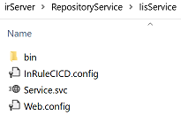

# irCatalog Service with CI/CD Features - On Premise Deployment

irCatalog® is a business rule management tool that provides centralized management of rules to ensure the integrity of business rules, keep everyone working on the latest version of rules, and promote sharing of common rules across customers, processes or applications.

The CI/CD solution requires a number of binaries and configuration parameters to be deployed to the Azure® irCatalog Service instance.  There are two options for deploying these components.  This deployment option can be used after normally installing and configuring irCatalog Service on Windows, hosted in IIS.

#### Deploying to an existing instance:

* [Add and Configure CI/CD Artifacts](#add-and-configure-ci\/cd-artifacts)


## Add and Configure CI/CD Artifacts

This section applies when deploying only the CI/CD add-on components to an existing instance of the irCatalog  Service.  The steps to configure the local/on premise catalog service with CI/CD features are:

* Create a backup of the folder where irCatalog service was originally installed.  The default location is C:\Program Files (x86)\InRule\irServer\RepositoryService\IisService.
* Download [InRule.Catalog.Service_Local.zip](..\releases\InRule.Catalog.Service_Local.zip) and unzip in a folder on the file system.
* Copy the content of the bin folder to the existing ...\RepositoryService\IIisService\bin\ folder.
* Add the InRuleCICD.config file to the original root folder of the irCatalog service file system deployment.

   

* Edit InRuleCICD.config with all the pertinent configuration parameters to drive the runtime behavior, like which actions to run on events and necessary configuration for each action.
* Edit the file web.config with these items:
    * The reference to the InRuleCICD.config file
    ```
        <appSettings file="InRuleCICD.config" />
    ```
    * Changes for enabling the event listener behavior, as detailed [here](InRuleCICD_WcfBehaviorExtension.md).
* Restart IIS service and confirm that the irCatalog service works properly: browse to the URL in browser, open a rule application in irAuthor®.
* Verify using irAuthor.  Using irAuthor you should now be able to normally connect to your catalog using the URL.
